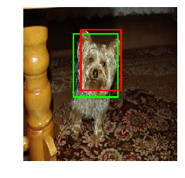

# Input/Output
* 256x256 RGB Image Tensor
* Normalized (0 to 1) 4 corners of the pet face

# Dogs and Cat Faces

Green box is the predicted face, red box is the marked face.

```python
box = model.predict(np.expand_dims(img, 0))[0]
box = [int(IMG_SIZE*i) for i in box]
annotated = cv2.rectangle((img*255) , (box[0], box[1]), (box[2], box[3]), (0, 255, 0), 2)
box = [int(IMG_SIZE * i) for i in y[0]]
annotated = cv2.rectangle((annotated) , (box[0], box[1]), (box[2], box[3]), (255, 0, 0), 2)

plt.axis('off')
plt.imshow((annotated ).astype('uint8'))
```



# Credits
Model was trained on the The Oxford-IIIT Pet Dataset.
http://www.robots.ox.ac.uk/~vgg/data/pets/
