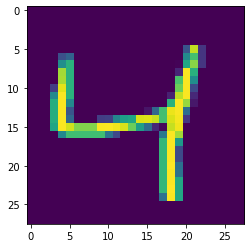

# Description

Identifies single handwritten digits

# Input / Output

- Input: [batch, 28, 28, 1]
- Output: Softmax of identified number 0 to 9

# Categories

Numbers 0 to 9

# Credits

history: https://en.wikipedia.org/wiki/MNIST_database
Data: https://keras.io/examples/mnist_cnn/
